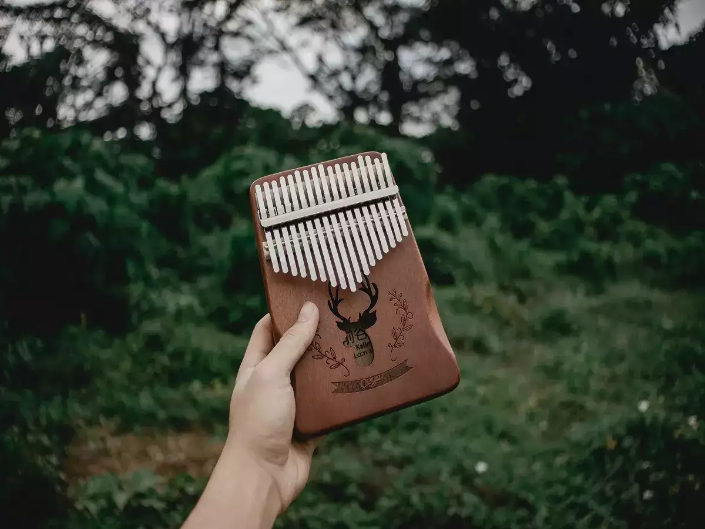

# About Myself
Hello, my name is Xue Zhang. In Chinese, my name means snow. Currently I have moved from sunny San Diego to rainy New York to pursue my academic dream. In my free time, I love travel, hiking, cooking, and learning new stuffs. Here's a [link](about.html) to a brief introductory landing page.

# My resume
Here's a [link](resume.html) to a page giving my academic and professional experience (resume).

# Other stuff
* During my time at community college, I have callobarated with other students to create a website about African American Artistry Association. Here's a link to the [African American Artistry Association](https://xuezhang0814.wixsite.com/aaaa) website.

* During my time in the pandemic, I have learned how to play Kalimba and create a website for anyone interested in joining with me. Here's a link to the [Kalimba Fans Club](https://1602521339.wixsite.com/kalimba-fans-club) website.

